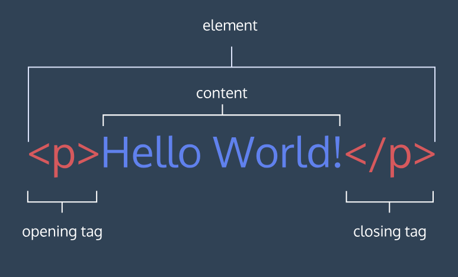

# HTML

## I.Elements and Structure

### 1.Introduction

HTML stands for Hyper Text Markup Language:

- A *markup* language is a computer language that defines the structure and presentation of raw text.
- In HTML, the computer can interpret *raw text* that is wrapped in HTML elements.
- *HyperText* is text displayed on a computer or device that provides access to other text through links, also known as *hyperlinks*.


### 2.HTML Anatomy




### 3.Key HTML Elements

**The Body**  
Only content inside the opening and closing body tags can be displayed to the screen.

```HTML
<body>
  <p>Hello World</p>
</body>
```

**Headings**  
In HTML, there are six different headings, or heading elements.

```HTML
<body>
  <h1>main headings</h1>
  <h2>subheadings1</h2>
  <h3>subheadings2</h3>
  <h4>subheadings3</h4>
  <h5>subheadings4</h5>
  <h6>subheadings5</h6>
</body>
```

**Divs**